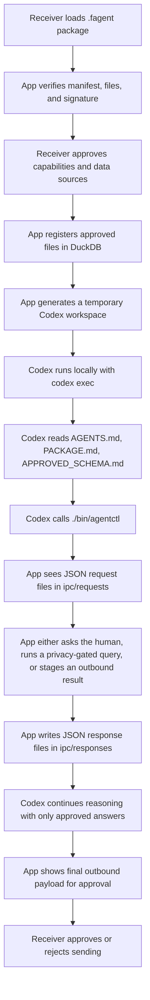

# Receiver Prototype Architecture

This note is for a backend / AI engineer who is new to Swift and new to macOS app structure.

The goal is not just to tell you what files exist.

The goal is to help you build the right mental model, because once the mental model is right, the Swift code becomes much less mysterious.

## The one-sentence idea

This prototype is a native macOS receiver app that runs a packaged Codex agent locally, but forces that agent to interact with the world only through app-controlled boundaries.

That sentence contains the entire architecture.

There are only four really important ideas:

1. The app owns trust.
2. The app owns permissions.
3. The app owns data access.
4. The model never gets raw data directly.

Everything else is implementation detail around those four points.

## How to think about the system

If you come from Python or Go, the easiest way to think about this codebase is:

- the SwiftUI app is the control plane
- Codex is the reasoning engine
- DuckDB is the local analytics engine
- the request / response files are the IPC layer
- the privacy gate is the safety valve between the model and the data

In other words, this is not "a Mac app that happens to call an LLM."

It is much closer to "a local orchestrator that happens to use a Mac UI as the consent surface."

That framing matters, because it tells you where the source of truth lives:

- not in Codex
- not in the package
- not in DuckDB

The source of truth lives in the receiver app.

The app decides:

- which package is loaded
- which capabilities are allowed
- which files are approved
- which questions are shown to the user
- which queries are executed
- which result is allowed to leave

Codex is intentionally not in charge of any of that.

## The end-to-end flow

Here is the main runtime loop.



The important design choice is that Codex never gets a direct handle to local files or a live database connection.

It only gets a synthetic workspace and one app-owned command surface: `agentctl`.

## The major code areas

There are two main targets in the package.

### `FederatedAgentsCore`

This is the reusable logic layer.

It contains:

- the package model types
- package loading and signature verification
- the DuckDB-backed approved data catalog
- the privacy gate
- the temporary session workspace generator
- the Codex process launcher

If you are a backend engineer, this is the part that will feel the most familiar.

It is mostly plain logic plus file IO plus subprocess management.

### `FederatedAgentsReceiver`

This is the macOS app layer.

It contains:

- the app entrypoint
- the SwiftUI screens
- the app state model
- the logic that reacts to request files from the running agent

This target is where user interaction lives.

It is not where the trust model lives conceptually.

The trust model lives in both layers:

- the core layer enforces the boundaries
- the UI layer exposes them to the human

## The package format

The receiver currently expects a packaged agent to be a directory with the extension `.fagent`.

The sample lives here:

- `Sources/FederatedAgentsReceiver/Resources/Samples/PeopleOpsCompensationAudit.fagent`

At minimum, the package contains:

- `manifest.json`
- `purpose.md`
- `instructions.md`

Optionally, it also contains:

- `signing-payload.json`
- a signature block in `manifest.json`

### Why this format is intentionally boring

A boring package format is a feature here.

You want the receiver to be able to inspect it with normal tools.

You want:

- easy debugging
- easy signing
- easy sender-side generation later
- easy explanations to users

If you zipped everything into some opaque binary blob too early, you would make the trust story worse, not better.

### How loading works

The main code is in:

- `Sources/FederatedAgentsCore/AgentPackageLoader.swift`

The loader does four simple things:

1. Read `manifest.json`.
2. Resolve and load the markdown files referenced by the manifest.
3. If a signature is present, load `signing-payload.json`.
4. Verify file digests and then verify the Ed25519 signature.

### What is being signed

The prototype signs the signing payload file, not the entire directory as a tarball or zip.

That signing payload contains:

- the package id
- the expiration time
- the SHA-256 digest of each tracked file

This is a normal pattern.

Instead of signing every file directly, you sign a structured statement about the files.

That gives you:

- a clean verification message
- a human-readable trust artifact
- the ability to decide exactly which files are part of the trust boundary

## The receiver app state model

The main coordinator on the app side is:

- `Sources/FederatedAgentsReceiver/ReceiverAppModel.swift`

If you are looking for "where the app actually does things," start there.

This object is the runtime controller for the whole session.

It owns:

- the loaded package
- the capability toggles
- the approved sources
- the log lines
- the agent messages
- pending user questions
- the staged outbound payload
- the active DuckDB catalog
- the generated temporary workspace
- the active Codex process runner

In backend terms, this object is basically the session manager.

The SwiftUI views are thin wrappers around it.

That is intentional.

If you later wanted to swap the UI layer, this is the seam you would keep.

## The UI

The UI is currently simple on purpose.

The main view is:

- `Sources/FederatedAgentsReceiver/ReceiverRootView.swift`

It exposes six visible blocks:

1. Request
2. Capabilities
3. Approved Data
4. Questions
5. Outbound Review
6. Activity

That is not just visual organization.

It mirrors the control model:

- understand the request
- approve the boundaries
- approve the inputs
- answer clarifications
- review the output
- inspect the runtime

In other words, the screen layout is part of the trust story.

## The temporary session workspace

This is the most important implementation trick in the whole prototype.

The code is here:

- `Sources/FederatedAgentsCore/SessionWorkspaceBuilder.swift`

When the receiver starts a session, the app creates a fresh temporary workspace under the system temp directory.

Inside that workspace, it writes a set of files that define the agent's world.

### The generated files

The builder creates:

- `AGENTS.md`
- `PACKAGE.md`
- `APPROVED_SCHEMA.md`
- `.receiver/skills/.../SKILL.md`
- `bin/agentctl`
- `.receiver/approved-sources.json`
- `ipc/requests/`
- `ipc/responses/`
- `outbound/`

This is the key move.

Instead of trying to "inject rules into the model" only through one giant prompt, we materialize the rules as files in the workspace.

That is much easier to reason about.

The generated workspace acts like a tiny operating system for the packaged agent.

### Why this is a good design

This gives you three things at once:

1. A reproducible environment.
2. A narrow tool surface.
3. A simple debugging story.

If the session behaves strangely, you can inspect the generated workspace and say:

- what instructions did Codex see?
- what schema did it see?
- what tool command did it have available?
- what request files did it generate?

That is a much better debugging posture than "the model had some hidden context and then it did something weird."

## How `codex exec` is actually called

The launch code is in:

- `Sources/FederatedAgentsCore/CodexProcessRunner.swift`

The receiver does not use interactive Codex.

It launches headless Codex with a fixed command.

Conceptually, it runs this:

```bash
codex exec \
  --json \
  --disable plugins \
  --disable shell_snapshot \
  --disable general_analytics \
  --sandbox workspace-write \
  --skip-git-repo-check \
  --ephemeral \
  "Carry out the packaged analysis request. Read AGENTS.md, PACKAGE.md, APPROVED_SCHEMA.md, and the skill docs in .receiver/skills before doing anything else."
```

A few of those flags matter a lot.

### `--json`

This makes Codex emit machine-readable event lines.

The runner parses those lines and turns them into:

- status updates
- agent messages
- raw log lines

Without `--json`, the app would be scraping human-oriented terminal output, which would be brittle.

### `--sandbox workspace-write`

This constrains Codex to the generated workspace.

That is important because the whole safety model depends on the generated workspace being the only world Codex can mutate.

You do not want Codex casually writing to arbitrary parts of the receiver's machine.

### `--skip-git-repo-check`

The generated session workspace is not a git repo.

This tells Codex not to treat that as an error.

### `--ephemeral`

This tells Codex not to persist a long-lived session history on disk.

For a consent-oriented receiver app, that is the right default.

The session should be local and bounded.

### Why the runner now disables plugins, shell snapshots, and analytics

When I reproduced the warnings you saw in the log, they came from Codex startup, not from the receiver logic.

Specifically:

- plugin manifest validation warnings from unrelated plugins in `~/.codex/.tmp/plugins`
- a benign shell snapshot cleanup warning

Those are not functional issues for the receiver app.

They are startup noise from global Codex features that this prototype does not need.

So the runner now disables:

- `plugins`
- `shell_snapshot`
- `general_analytics`

This keeps the log closer to the actual app session.

## How the app and Codex talk to each other

This is the second major implementation trick.

The bridge is not sockets.
The bridge is not gRPC.
The bridge is not an embedded scripting runtime.

The bridge is files.

That is a very good prototype choice.

### The command surface

Codex does not get arbitrary tools.

It gets a generated shell command:

- `./bin/agentctl`

This script is created by `SessionWorkspaceBuilder`.

It supports a tiny command surface:

- `show-package`
- `list-sources`
- `ask-user`
- `run-safe-query`
- `submit-result`
- `log`

### What `agentctl` really does

`agentctl` is not the tool itself.

It is a request writer.

For example, if Codex runs:

```bash
./bin/agentctl ask-user --title "Compensation field" --prompt "Which numeric field should represent total compensation?"
```

the script writes a JSON file into:

- `ipc/requests/<uuid>.json`

Then it waits for a matching response file to appear in:

- `ipc/responses/<uuid>.json`

The app is polling the requests directory.

When it sees that request, it turns it into UI.

When the human answers, the app writes the response JSON.

Then `agentctl` returns the answer back to Codex.

That is the entire protocol.

### Why the file-based IPC is good here

Because it is:

- inspectable
- durable enough for a prototype
- easy to debug
- easy to replay mentally
- decoupled from UI timing

If something breaks, you can open the request and response JSON files directly.

That is exactly the kind of operational clarity you want early on.

## How DuckDB is used

The DuckDB layer lives in:

- `Sources/FederatedAgentsCore/ApprovedDataCatalog.swift`

This layer is the local analytics substrate.

### What problem DuckDB is solving

The problem is not "how do I run SQL."

The real problem is:

"How do I normalize a few approved local data sources into one analytical surface that the privacy layer can reason about?"

DuckDB is a good prototype answer because:

- it runs embedded, so no separate database server is required
- it can read CSV and Parquet directly
- it gives one SQL surface for many data shapes
- it is easy to use from Swift through `duckdb-swift`

### What the app actually stores in DuckDB

When the user approves a CSV or Parquet file, the catalog creates a view in an in-memory DuckDB database.

For CSV:

```sql
CREATE OR REPLACE VIEW alias AS
SELECT * FROM read_csv_auto('path', SAMPLE_SIZE=-1);
```

For Parquet:

```sql
CREATE OR REPLACE VIEW alias AS
SELECT * FROM read_parquet('path');
```

Two details matter here.

First, the database is in memory.

That means this is a transient analytical layer, not a persistent local warehouse.

Second, the app creates views with sanitized aliases.

That means the agent reasons about logical table names like `people_data`, not arbitrary raw filesystem paths.

### What the agent sees

The agent does not get direct DuckDB access.

The agent sees:

- table aliases
- column names
- column types
- a heuristic flag saying whether a column name looks sensitive

That schema description is turned into `APPROVED_SCHEMA.md`.

So the agent gets the shape of the data, not the data itself.

That is the whole privacy story in miniature.

## How the privacy gate works right now

The privacy layer is in:

- `Sources/FederatedAgentsCore/PrivacyEngine.swift`

Right now, this is not true differential privacy.

It is a strict aggregate-only gate with a clean interface that you can later replace with Qrlew.

### The current contract

The `PrivacyEngine` protocol is tiny:

```swift
func evaluate(sql: String, approvedSources: [ApprovedDataSource]) -> PrivacyDecision
```

That small API is good.

It means the rest of the app does not need to know whether the implementation is:

- a toy rule engine
- a Qrlew rewriter
- a remote privacy service
- something else entirely

### What the prototype implementation rejects

The current implementation rejects:

- mutating SQL like `INSERT`, `UPDATE`, `DELETE`, `DROP`, `ALTER`
- file-reading SQL like `read_csv` and `read_parquet`
- non-`SELECT` queries
- queries with no aggregate function
- queries that mention columns whose names look identifier-like

That is intentionally narrow.

The point is to prove the boundary, not to maximize analytical flexibility yet.

### What happens when a query is approved

If the query passes the gate, the prototype wraps it and limits the result:

```sql
SELECT * FROM (
  <original query>
) AS privacy_safe_result
LIMIT 100
```

Then the app runs the rewritten SQL in DuckDB and converts the result set into strings before handing it back to Codex.

That string conversion is subtle but important.

It keeps the UI and IPC layer simpler, because the result payload becomes plain JSON:

- column names
- rows as strings

Again, very backend-friendly.

### Where Qrlew would plug in

When you replace the prototype gate with Qrlew, the main thing that changes is the `evaluate` method.

The rest of the runtime can remain largely the same.

The future shape would be:

1. Codex proposes SQL.
2. The app calls the Qrlew-backed privacy engine.
3. The privacy engine returns either:
   - rejected
   - approved with rewritten DP SQL
4. DuckDB executes only the rewritten SQL.
5. The agent sees only the sanitized result.

That is why keeping `PrivacyEngine` tiny was the right choice.

## How questions and outbound review work

This is controlled in `ReceiverAppModel`.

### Asking the user a question

When Codex uses `agentctl ask-user`, the app:

1. detects a request JSON with kind `ask_user`
2. turns it into a `PendingQuestion`
3. shows it in the Questions section
4. waits for the receiver to answer
5. writes a response JSON

That response is the only thing Codex gets back.

It does not get hidden UI state or direct access to the form.

### Submitting a final result

When Codex uses `agentctl submit-result`, the app:

1. stages an `OutboundDraft`
2. shows the exact JSON payload in the Outbound Review section
3. waits for approval or rejection
4. writes the decision back to the response file

Right now, approval saves the payload locally to the session's `outbound/approved-result.json`.

That is the prototype stand-in for real delivery to the sender.

This was a good prototype cut.

You want the review boundary in place before you optimize transport.

## Why there is both `purpose.md` and `instructions.md`

This is subtle, but worth preserving.

The distinction is:

- `purpose.md` explains what the request is for
- `instructions.md` explains what the agent should do

That separation is healthy.

It mirrors the difference between:

- the human trust story
- the machine execution story

Those two should overlap, but they should not be collapsed into one blob too early.

## What is real and what is still a prototype

Some parts of this repo are already structurally correct.

They are good shapes to keep.

### Structurally good already

- packaged request loading
- signed package verification
- generated agent workspace
- file-based agent IPC
- local headless Codex session
- DuckDB as a unified local analysis layer
- receiver approval before outbound handoff
- the `PrivacyEngine` abstraction seam

### Still intentionally prototype-grade

- the privacy engine is not yet Qrlew-backed
- database connectors beyond CSV / Parquet are not implemented
- outbound delivery is local save, not sender callback transport
- the UI is functional, not polished
- capability toggles are shown, but not yet deeply enforced per feature

That is okay.

The important thing is that the current simplifications mostly sit behind good boundaries.

## Where to start if you want to extend it

If you are thinking like a backend engineer, here is the order I would recommend.

### 1. Replace the privacy engine

This is the most important product upgrade.

The whole promise of the system gets stronger once the privacy gate becomes a real deterministic DP rewrite layer.

The main seam is:

- `PrivacyEngine`

### 2. Add a real outbound transport

Right now the app saves approved JSON locally.

The next step is to send it to a callback endpoint defined in the package.

That transport should remain app-owned and only happen after explicit approval.

### 3. Add one real database connector

Do not add five at once.

Add one.

A good next candidate would be:

- Postgres read-only connection metadata + bounded analytical registration

### 4. Enforce capability toggles more deeply

The UI already exposes capability approval.

The next step is to thread those approvals down into the runtime so that:

- no approved CSV capability means no CSV selection
- no ask-followups capability means `ask-user` requests are rejected
- no send capability means outbound staging is blocked

That would make the trust story tighter.

## Why Swift is not the hard part here

If you are new to Swift, do not let the syntax distract you.

Most of the hard problems here are not Swift problems.

They are systems design problems:

- where to put trust
- how to define boundaries
- how to give the model useful leverage without raw access
- how to make the runtime inspectable

Swift is mostly the vehicle.

The core logic here maps cleanly to concepts you already know from Python or Go:

- structs are typed data models
- classes here are mostly stateful coordinators
- `Process` is subprocess launching
- `FileManager` is filesystem IO
- `JSONEncoder` / `JSONDecoder` are exactly what they sound like
- SwiftUI is the view layer over app state

The architectural ideas should feel familiar even if the syntax does not.

## The shortest accurate summary

This prototype works by creating a fake little world for Codex.

That world contains:

- the request
- the allowed schema
- a few narrow skills
- one app-owned bridge command

Codex reasons inside that world.

Whenever it needs something real, it has to ask the app.

That is why the receiver stays in control.

That is also why the design is worth continuing.
